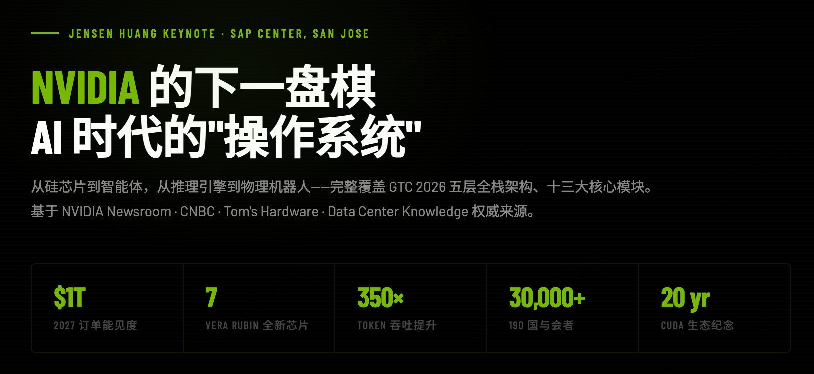

# NVIDIA GTC 2026 · AI 时代"操作系统"全景参考

> 基于 2026 年 3 月 16 日黄仁勋 GTC 主题演讲，整理的**交互式全栈架构参考**。覆盖 5 层架构、13 个核心模块，点击每个模块可展开来自官方 Newsroom、CNBC、Tom's Hardware 等权威来源的详情。

<!-- 部署 GitHub Pages 后，将下方链接替换为你的实际地址 -->
**→ [在线访问 Live Demo](https://siryzhang.github.io/nvidia-gtc2026-ai-os-reference/)**

---

---

## 涵盖内容

| 层级 | 模块 |
|------|------|
| ▲ 应用层 | 物理 AI（机器人/自动驾驶） · 数字 AI（医疗/制药/企业） · 消费级 AI（GeForce/DLSS 5） |
| 智能体层 | OpenClaw 平台 · NemoClaw 企业安全栈 |
| 推理层 | 推理引擎拐点 · 模型训练 |
| 平台层 | CUDA 20 年生态 · NeMo/Nemotron Coalition · Omniverse/DSX |
| ▼ 硬件层 | GPU 四代路线图 · Groq LPU · NVLink 互联 |

每个模块包含：核心数据、技术规格、合作伙伴、黄仁勋原话引用。

---

## 核心数据一览

| 指标 | 数值 |
|------|------|
| 2027 年订单能见度 | **$1 万亿** |
| Vera Rubin 全新芯片数量 | **7 颗**（5 种机架系统） |
| Token 吞吐提升（Hopper → Vera Rubin） | **350×** |
| GTC 与会者 | **30,000+ 来自 190 国** |
| CUDA 生态年龄 | **20 周年** |
| Groq 收购规模 | **$200 亿**（Nvidia 史上最大并购） |

---

## 技术说明

- **纯静态单文件** — 无依赖、无框架、无构建步骤，一个 `.html` 文件即可运行
- **交互式详情面板** — 点击模块展开双列详情，同层切换，支持折叠
- **NVIDIA 品牌视觉** — 纯黑底 + `#76b900` 官方绿，Barlow Condensed 字体
- **响应式布局** — 桌面与移动端均可正常浏览

---

## 数据来源

所有详情内容经以下来源交叉核实：

- [NVIDIA 官方 Newsroom](https://nvidianews.nvidia.com/news/nvidia-vera-rubin-platform) — Vera Rubin 官方发布
- [NVIDIA 官方 Blog](https://blogs.nvidia.com/blog/gtc-2026-news/) — GTC 2026 实时更新
- [CNBC](https://www.cnbc.com/2026/03/16/nvidia-gtc-2026-ceo-jensen-huang-keynote-blackwell-vera-rubin.html) — 黄仁勋演讲报道
- [Data Center Knowledge](https://www.datacenterknowledge.com/data-center-chips/gtc-2026-nvidia-unveils-vera-rubin-ai-platform-eyes-1t-by-2027) — Vera Rubin 技术深度解析
- [Tom's Hardware](https://www.tomshardware.com/news/live/nvidia-gtc-2026-keynote-live-blog-jensen-huang) — GTC 2026 现场实时博客
- [The GPU.ai](https://thegpu.ai/p/nvidia-gtc-2026-full-breakdown) — 完整技术规格拆解

---

## 关于

这是我作为 **Human-AI Collaboration Architect** 日常研究工作的一部分——用 AI 工具将高密度行业信息转化为可沉淀、可分享的交互式知识资产。

如果这个参考对你有帮助，欢迎 ⭐ Star。

---

*数据截至 2026 年 3 月 19 日 GTC 2026 结束。*
